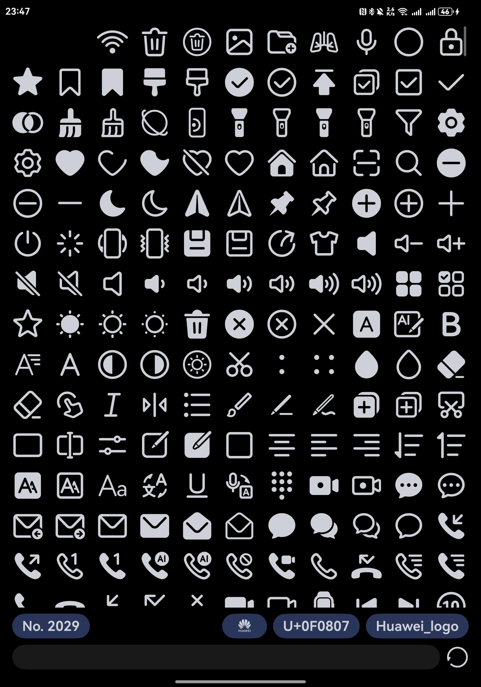
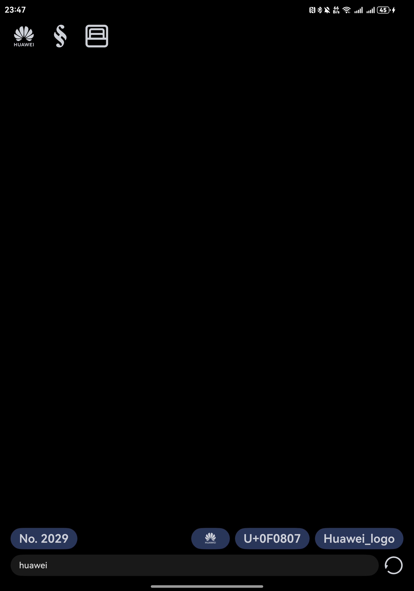

# Symbolu NEXT - 符号 NEXT！
A meowy application showcasing all (?) HarmonyOS Symbols in a chaotic manner.

一个混乱地展示所有（？）HarmonyOS Symbol 的神奇喵喵程序。

Based font - 基于字体: `<your_ohos_sdk_path>\15\previewer\common\bin\fonts\HMSymbolVF.ttf`

A [sample](python_script/HMSymbolVF.ttf) of which is included in [python_script](python_script).

这个字体的 [样本](python_script/HMSymbolVF.ttf) 被包含在 [python_script 文件夹](python_script) 里。

## Meows - 喵喵

Uses lazyForEach to accelerate the display render!

使用 lazyForEach 来加速显示渲染！

## Previews - 预览

